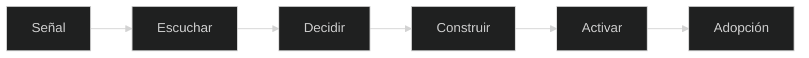

 

  

**Customer Success · Data · AI · Automation · Systems**

Convierto problemas de cliente y de operación en sistemas que se miden y se usan.

`MURCIA · ESPAÑA · REMOTO · 2026`

 

[Español](#español) · [English](#english)

---

## El deck

Una sola página. No es un CV pasado a HTML. Papel `#FAF7F2`, tinta `#2A2622`, oro `#C4A574`. Fraunces, Inter, JetBrains Mono. Español e inglés. Claro y oscuro.

Se mueve con scroll, flechas, el índice lateral, `Ctrl` o `Cmd` + `K`, y el modo recruiter.

### [Abrir el professional deck](https://gracianb.github.io/professional-deck/)

---

## Español

No separo el trabajo con clientes del trabajo con datos, ni los datos del sistema que los convierte en una decisión.

Cliente, entender, datos, decidir, automatizar, IA, sistema, adopción.

> Entender el problema, convertirlo en criterio, construir el sistema, conseguir que se use.

No me paro en el análisis. Lo llevo hasta algo que una persona puede abrir.

La capa humana es Customer Success, contexto y adopción. La capa de sistema es datos, automatización, IA y el código. Juntas, o no hay adopción. Construir tecnología sin entender a las personas también es una forma cara de construir problemas.

### Bodytone

El caso que se puede comprobar no es un pantallazo. Es el Help Center público.

Pregunta, conocimiento, estructura, acceso, acción.

[Help Center de Bodytone](https://bodytonehelp.zendesk.com/hc/es)

**Público · en producción · verificable**

El relato del caso está en el deck, diapositiva del caso estrella, y en [proyecto-bodytone.html](https://gracianb.github.io/professional-deck/proyecto-bodytone.html).

### Casos

Estos tres no están en producción. Son casos del deck: se abren, se leen, y una persona cierra.

| Caso | Qué enseña | |
| --- | --- | --- |
| Bodytone Support OS | Conocimiento, soporte, adopción | [Live](https://bodytonehelp.zendesk.com/hc/es) · [Caso](https://gracianb.github.io/professional-deck/proyecto-bodytone.html) |
| Calculadora de pricing | Datos, reglas, una decisión | [Caso](https://gracianb.github.io/professional-deck/proyecto-calculadora.html) |
| Profile Finder | Búsqueda. El falso positivo no pasa solo | [Caso](https://gracianb.github.io/professional-deck/proyecto-linkedin.html) |
| Outreach | Borrador con IA. Nada se envía solo | [Caso](https://gracianb.github.io/professional-deck/proyecto-outreach.html) |

### Números

| | |
| --- | --- |
| Experiencia | 16+ años |
| Cara al cliente | 10+ años |
| Reglas de pricing | 200+ |
| Centros | 5+ |
| Países | 4 |

El dato crudo se limpia, se compara, se segmenta y entonces se decide. Si no llega a una decisión, no era análisis. Era un archivo.

### Trayectoria

Customer Success, operaciones, datos, pricing, automatización, IA, sistemas. No es una línea recta. Es una capa encima de otra.

En paralelo, yoga: presencia, enseñanza, personas. No son mundos opuestos. Los dos acaban en alguien que tiene que usar lo que construyes.

| Organización | Área | Foco |
| --- | --- | --- |
| Minderest | Customer Success | Pricing, e-commerce, cuentas internacionales |
| Bodytone | Soporte / sistemas | Conocimiento, Support OS |
| Majorel | Contenido / operaciones | Google, YouTube, operación internacional |
| ECI | Retail | Tienda y experiencia de cliente |
| Mood Fitness | Wellness | Yoga y enseñanza |

Idiomas: español, inglés, italiano, portugués, francés.

### Qué hago

| | |
| --- | --- |
| Customer Success | Adopción, retención, relación |
| Estrategia | Problema, prioridad, decisión |
| Análisis | Datos, pricing, KPIs |
| Construcción | HTML, CSS, JavaScript, Python |
| IA | GenAI, agentes, flujos. Con una persona en el cierre |
| Automatización | n8n, Make, Zapier |
| Personas | Comunicación, formación, yoga |

No intento demostrar que sé muchas herramientas. Intento demostrar para qué sirven. Herramienta no es valor. El valor aparece cuando problema, contexto, datos, sistema y personas llegan a un resultado.

Aprendo construyendo: idea, construir, romper, depurar, aprender, publicar, repetir.

### Yoga

La otra pista, desde 2019. Presencia, respiración, práctica real. No es un adorno del CV.

[Yoga instructor](https://gracianb.github.io/yoga-instructor/)

### Ecosistema

| | | |
| --- | --- | --- |
| 01 | [Professional Deck](https://gracianb.github.io/professional-deck/) | Esta puerta |
| 02 | [Systems Lab](https://gracianb.github.io/systems-lab/) | Ohana, Vórtice, el lab |
| 03 | [Yoga](https://gracianb.github.io/yoga-instructor/) | Práctica |
| Hub | [GracianB](https://gracianb.github.io/GracianB/) | Las tres juntas |

Ohana y Vórtice viven en Play, no aquí. Este repo es la evidencia profesional.

<b>PDFs</b>

 

| Documento | |
| --- | --- |
| CV 2026 · ES | [PDF](./Gracian_Baena_CV_2026_ES.pdf) |
| CV 2026 · EN | [PDF](./Gracian_Baena_CV_2026_EN.pdf) |
| Carta · ES | [PDF](./Gracian_Baena_Carta_Presentacion_ES.pdf) |
| Cover letter · EN | [PDF](./Gracian_Baena_Cover_Letter_EN.pdf) |
| CV yoga · ES | [PDF](./Gracian_Baena_CV_Yoga_ES.pdf) |
| CV yoga · EN | [PDF](./Gracian_Baena_CV_Yoga_EN.pdf) |
| Carta yoga · ES | [PDF](./Gracian_Baena_Carta_Yoga_ES.pdf) |
| Cover yoga · EN | [PDF](./Gracian_Baena_Cover_Letter_Yoga_EN.pdf) |

---

## English

I do not split customer work, data and the system that turns them into a decision.

Customer, understand, data, decide, automate, AI, system, adoption.

> Understand the problem, turn it into criteria, build the system, get it used.

I do not stop at the analysis. I take it to something a person can open. The human layer is Customer Success, context and adoption. The system layer is data, automation, AI and the code. Without both, there is no adoption.

### Bodytone

The case you can check is not a screenshot. It is the public Help Center: question, knowledge, structure, access, action.

[Bodytone Help Center](https://bodytonehelp.zendesk.com/hc/es) · [case](https://gracianb.github.io/professional-deck/proyecto-bodytone.html)

### Cases

These three are not in production. They are deck cases: you open them, you read them, a person closes.

| Case | What it shows | |
| --- | --- | --- |
| Bodytone Support OS | Knowledge, support, adoption | [Live](https://bodytonehelp.zendesk.com/hc/es) |
| Pricing calculator | Data, rules, a decision | [Case](https://gracianb.github.io/professional-deck/proyecto-calculadora.html) |
| Profile Finder | Search. A false positive does not pass alone | [Case](https://gracianb.github.io/professional-deck/proyecto-linkedin.html) |
| Outreach | An AI draft. Nothing sends by itself | [Case](https://gracianb.github.io/professional-deck/proyecto-outreach.html) |

| | |
| --- | --- |
| Experience | 16+ years |
| Customer-facing | 10+ years |
| Pricing rules | 200+ |
| Centres | 5+ |
| Countries | 4 |

Raw data is cleaned, compared, segmented, and only then decided. If it never becomes a decision, it was not analysis. It was a file.

Career, as layers: Customer Success, operations, data, pricing, automation, AI, systems. Yoga runs beside that, since 2019. They are not opposite worlds. Both end with a person who has to use what you built.

| Organisation | Area | Focus |
| --- | --- | --- |
| Minderest | Customer Success | Pricing, e-commerce, international accounts |
| Bodytone | Support / systems | Knowledge, Support OS |
| Majorel | Content / operations | Google, YouTube, international ops |
| ECI | Retail | Store and customer experience |
| Mood Fitness | Wellness | Yoga and teaching |

Languages: Spanish, English, Italian, Portuguese, French.

Customer Success, strategy, analysis, and building: HTML, CSS, JavaScript, Python, GenAI with a human in the close, and automation with n8n, Make and Zapier. A tool is not value. Value shows up when problem, context, data, system and people reach an outcome.

I learn by building: idea, build, break, debug, learn, ship, repeat.

[Yoga](https://gracianb.github.io/yoga-instructor/) is the other track. Ohana and Vórtice live in [Play](https://gracianb.github.io/systems-lab/), not in this repo. This one is the professional evidence. The three doors meet at the [hub](https://gracianb.github.io/GracianB/).

---

### Let's build something useful

  

[Deck](https://gracianb.github.io/professional-deck/) · [Lab](https://gracianb.github.io/systems-lab/) · [Yoga](https://gracianb.github.io/yoga-instructor/) · [Hub](https://gracianb.github.io/GracianB/)

 

Murcia · 2026

